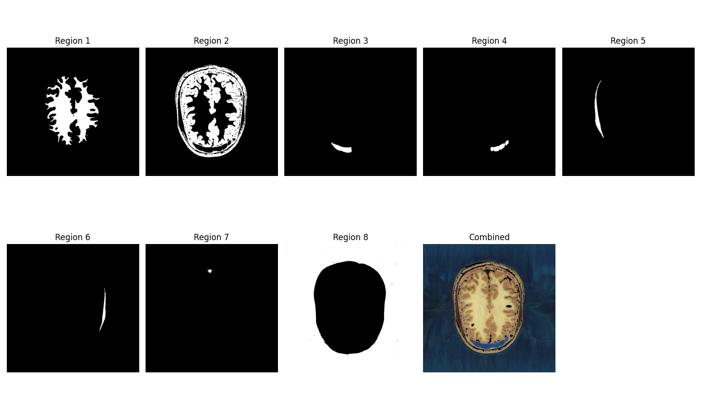

# Interactive Region Growing Segmentation

An interactive Python tool for image segmentation using the region growing algorithm with real-time visualization.

---

## Overview

This project implements an interactive region growing segmentation algorithm that allows users to manually select seed points on an image and watch as regions grow based on pixel intensity similarity. The tool is particularly useful for medical image analysis, object extraction, and image segmentation tasks.

---

## Demo

This is a demo of how this program works. The interactive segmentation part and then the obtained results.

<p align="center">
  <video src="outputs/demo.mp4" autoplay loop controls>
    aaaa
  </video>
</p>

<!-- <p align="center">
  
</p> -->

---

## Features

- **Interactive seed selection**: Click directly on the image to place seed points
- **Real-time visualization**: See segmentation results update immediately
- **Dual display mode**: View original image with seeds and segmentation results side-by-side
- **Multiple segmentation modes**:
  - `constant`: Compare pixels against the original seed value
  - `average`: Dynamically update the reference value as the region grows
- **Multi-region support**: Add multiple seed points to segment different regions
- **Color preservation**: Segmented regions retain their original colors from the source image

---

## Usage

### Basic Usage

```python
from region_growing import RegionGrowing

# Initialize with an image
rg = RegionGrowing(
    img_path="input.png",
    thresh=30,
    mode="average"
)

# Run the interactive tool
rg.run()
```

### Interactive Controls

- **Left Click**: Add a new seed point at the cursor location
- **ENTER**: Complete segmentation and show detailed results
- **C**: Clear all seeds and regions, start over


### Output

The tool provides two visualization stages:

1. **Interactive Stage**: 
   - Left panel: Original grayscale image with numbered seed markers
   - Right panel: Real-time segmentation showing extracted regions in color

2. **Results Stage** (after pressing ENTER):
   - Individual region masks for each seed point
   - Combined segmentation showing all regions together
